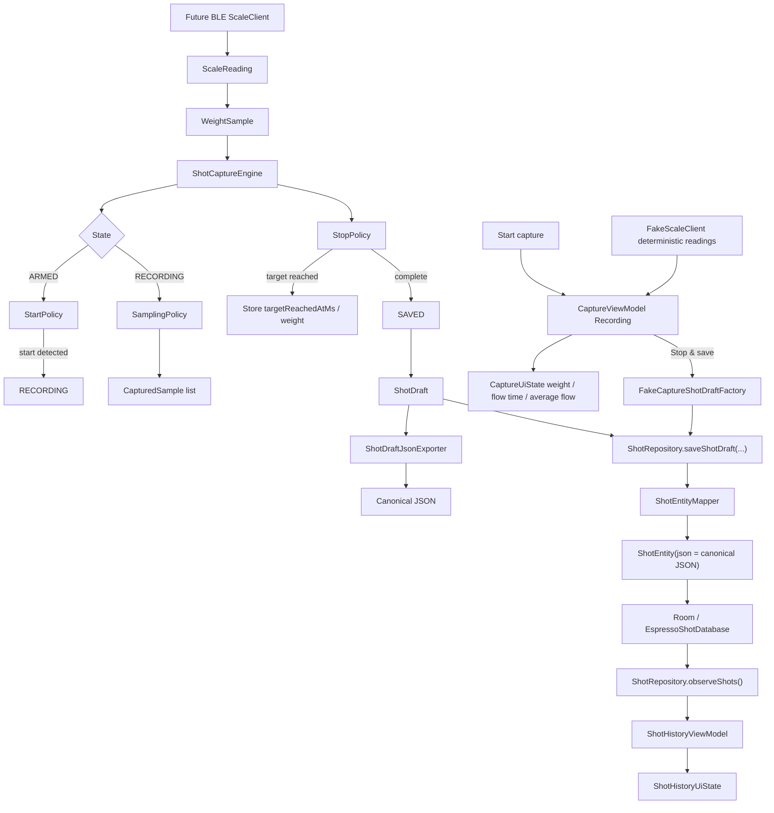

# Architecture

This Android app is being built around a small, testable espresso shot capture core. The current implementation is intentionally layered so capture rules, local persistence, export contracts, and UI state can evolve before real scale hardware is added.

## Current Layers

### Domain Layer

Package: `com.example.espressoshotcapture.capture.domain`

The domain layer contains plain Kotlin models that describe shot capture data. It has no Android, storage, BLE, or UI dependencies.

Key model groups:

- Capture inputs: `CaptureTarget`, `WeightSample`
- Captured time series: `CapturedSample`
- Shot metadata: `ShotTiming`, `ShotResult`, `ShotDraft`
- Scale boundary: `ScaleReading`, `ScaleConnectionState`, `ScaleClient`
- Controlled vocabularies: `ShotSource`, `StartMode`, `StopMode`, `ShotStatus`, `SampleSource`

These types are the shared language between the engine, export layer, UI, and future scale integration.

`ScaleClient` is a pure Kotlin interface for future hardware adapters. It exposes connection state and scale readings as flows, but does not contain Android BLE APIs, permissions, or Half Decent protocol parsing.

`FakeScaleClient` is the current local simulation adapter. It implements `ScaleClient` with deterministic connection state and deterministic fake readings so the app can smoke-test recording UI behavior before BLE exists. It is not a production BLE adapter and does not parse real scale packets.

### Engine Layer

Package: `com.example.espressoshotcapture.capture.engine`

The engine layer owns capture state and shot lifecycle logic. It is pure Kotlin and currently handles:

- Scale connection/tare/arm/reset state transitions
- Automatic recording start via `StartPolicy`
- Raw sample capture via `SamplingPolicy`
- Target reached and completion detection via `StopPolicy`
- Completed in-memory `ShotDraft` creation

Policy classes are separate from `ShotCaptureEngine` so individual rules can be tested independently and evolved without turning the engine into a large conditional block.

### Export Layer

Package: `com.example.espressoshotcapture.export`

The export layer serializes completed `ShotDraft` values into the canonical external JSON contract:

```json
{
  "schemaVersion": 1,
  "shot": {}
}
```

`ShotDraftJsonExporter` is pure Kotlin. It does not write files, access Android storage, launch share intents, or persist data. It only converts an in-memory draft into deterministic JSON with null values included.

`ShotExportFileFactory` creates an in-memory export file descriptor for a single `ShotDraft`. It provides a JSON file name, MIME type, and content, but still does not write files or launch Android share flows.

### Persistence/Data Layer

Packages:

- `com.example.espressoshotcapture.persistence`
- `com.example.espressoshotcapture.repository`

The persistence layer stores saved shots locally with Room. It intentionally stores the canonical `ShotDraft` JSON payload instead of decomposing shots, samples, and analytics into relational tables.

Current persistence types:

- `ShotEntity`: Room entity for the `shots` table. It has `id` as the primary key, `json` for the canonical exported `ShotDraft` payload, and `createdAtEpochMillis` for history display and future ordering.
- `ShotDao`: Room DAO for inserting, observing, reading, and deleting saved shot entities. `observeShots()` exposes `Flow<List<ShotEntity>>`.
- `EspressoShotDatabase`: Room database version 1 containing `ShotEntity` and exposing `ShotDao`.
- `ShotEntityMapper`: pure mapper that converts a `ShotDraft` into `ShotEntity` by using `ShotDraftJsonExporter.export(...)`.
- `ShotRepository`: thin app-facing data abstraction over `ShotDao`. It exposes shot observation and save methods, including `saveShotDraft(...)`.

History UI consumes this layer through `ShotHistoryViewModel`, which observes `ShotRepository.observeShots()`, maps entities with `ShotHistoryStateMapper.fromEntities(...)`, and exposes `ShotHistoryUiState`.

### Capture UI Layer

Package: `com.example.espressoshotcapture.capture`

The current app root shows a minimal capture screen plus shot history. Real scale capture is not wired yet. For MVP smoke testing, `CaptureViewModel` supports a manual fake capture flow:

1. The user taps `Start capture`.
2. `CaptureViewModel` moves from Ready to Recording.
3. The ViewModel starts a fake reading loop against `FakeScaleClient`.
4. Deterministic `ScaleReading` values are mapped toward capture-style sample data and used to update `CaptureUiState`.
5. The screen displays current weight, flow time, and average flow from `CaptureUiState`.
6. The user taps `Stop & save`.
7. `CaptureViewModel` creates a fake but valid `ShotDraft` through `FakeCaptureShotDraftFactory`.
8. The draft is saved through `ShotRepository.saveShotDraft(...)`.
9. History updates through the existing repository and Room observation path.

This fake recording path is only a local MVP simulation. Real BLE connection handling, Half Decent packet parsing, and real `ShotCaptureEngine` wiring are still future work.

### Test Utilities

Package: `com.example.espressoshotcapture.capture.testutil`

`TestWeightSamples` is a test-only helper for generating `WeightSample` values with increasing timestamps. It exists to keep engine tests readable without introducing a production simulator.

## Data Flow



## Boundaries

Current implementation deliberately excludes:

- BLE scale implementation
- Half Decent protocol parsing
- Real `ShotCaptureEngine` wiring into the capture UI
- File export and share flows
- Import tooling

Those pieces are planned after the core engine and local persistence workflow are stable.
