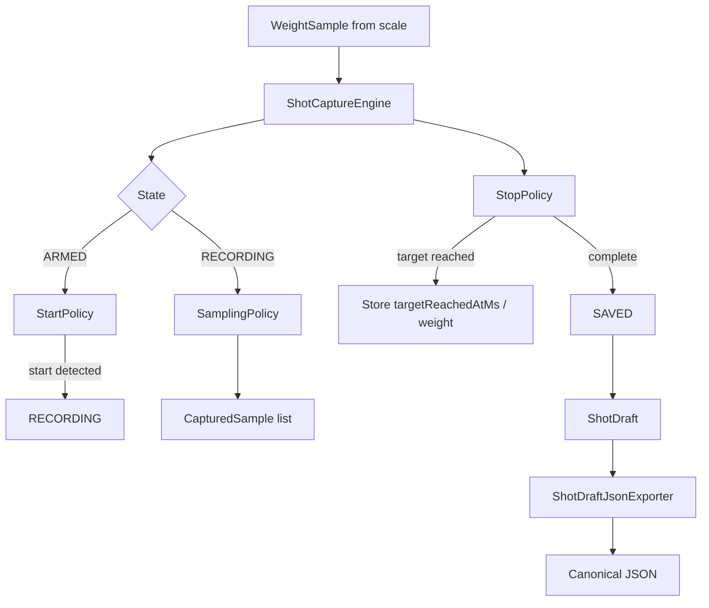

# Architecture

This Android app is being built around a small, testable espresso shot capture core. The current implementation is intentionally layered so the capture rules can be developed and verified before hardware, persistence, and UI workflows are added.

## Current Layers

### Domain Layer

Package: `com.example.espressoshotcapture.capture.domain`

The domain layer contains plain Kotlin models that describe shot capture data. It has no Android, storage, BLE, or UI dependencies.

Key model groups:

- Capture inputs: `CaptureTarget`, `WeightSample`
- Captured time series: `CapturedSample`
- Shot metadata: `ShotTiming`, `ShotResult`, `ShotDraft`
- Controlled vocabularies: `ShotSource`, `StartMode`, `StopMode`, `ShotStatus`, `SampleSource`

These types are the shared language between the engine and export layer.

### Engine Layer

Package: `com.example.espressoshotcapture.capture.engine`

The engine layer owns capture state and shot lifecycle logic. It is pure Kotlin and currently handles:

- Scale connection/tare/arm/reset state transitions
- Automatic recording start via `StartPolicy`
- Raw sample capture via `SamplingPolicy`
- Target reached and completion detection via `StopPolicy`
- Completed in-memory `ShotDraft` creation

Policy classes are separate from `ShotCaptureEngine` so individual rules can be tested independently and evolved without turning the engine into a large conditional block.

### Export Layer

Package: `com.example.espressoshotcapture.export`

The export layer serializes completed `ShotDraft` values into the canonical external JSON contract:

```json
{
  "schemaVersion": 1,
  "shot": {}
}
```

`ShotDraftJsonExporter` is pure Kotlin. It does not write files, access Android storage, launch share intents, or persist data. It only converts an in-memory draft into deterministic JSON with null values included.

### Test Utilities

Package: `com.example.espressoshotcapture.capture.testutil`

`TestWeightSamples` is a test-only helper for generating `WeightSample` values with increasing timestamps. It exists to keep engine tests readable without introducing a production simulator.

## Data Flow



## Boundaries

Current implementation deliberately excludes:

- BLE scale integration
- Room persistence
- Android storage and share flows
- UI capture workflows
- Import/export tooling beyond in-memory JSON serialization

Those pieces are planned after the core engine contract is stable.
