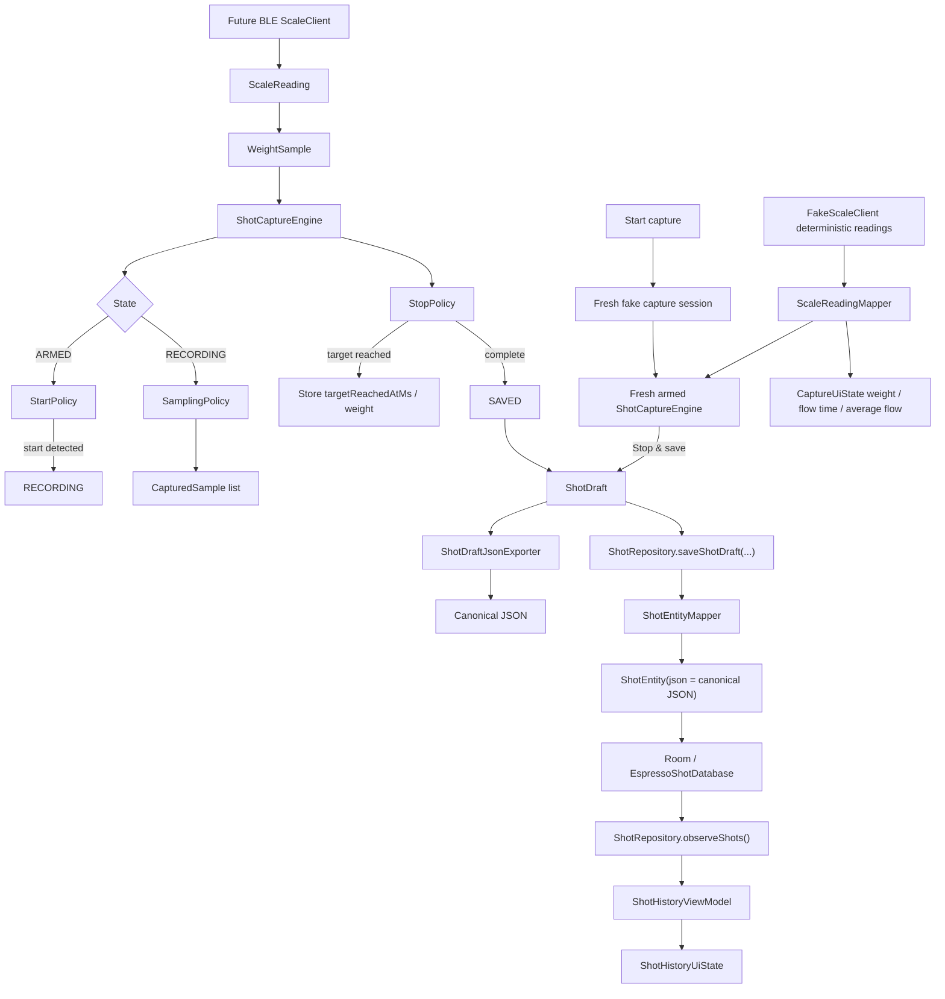

# Architecture

This Android app is being built around a small, testable espresso shot capture core. The current implementation is intentionally layered so capture rules, local persistence, export contracts, and UI state can evolve before real scale hardware is added.

## Current Layers

### Domain Layer

Package: `com.example.espressoshotcapture.capture.domain`

The domain layer contains plain Kotlin models that describe shot capture data. It has no Android, storage, BLE, or UI dependencies.

Key model groups:

- Capture inputs: `CaptureTarget`, `WeightSample`
- Captured time series: `CapturedSample`
- Shot metadata: `ShotTiming`, `ShotResult`, `ShotDraft`
- Scale boundary: `ScaleReading`, `ScaleConnectionState`, `ScaleClient`
- Controlled vocabularies: `ShotSource`, `StartMode`, `StopMode`, `ShotStatus`, `SampleSource`

These types are the shared language between the engine, export layer, UI, and future scale integration.

`ScaleClient` is a pure Kotlin interface for future hardware adapters. It exposes connection state and scale readings as flows, but does not contain Android BLE APIs, permissions, or Half Decent protocol parsing.

`FakeScaleClient` is the current local simulation adapter. It implements `ScaleClient` with deterministic connection state and deterministic fake readings so the app can smoke-test recording UI behavior before BLE exists. It is not a production BLE adapter and does not parse real scale packets.

### Engine Layer

Package: `com.example.espressoshotcapture.capture.engine`

The engine layer owns capture state and shot lifecycle logic. It is pure Kotlin and currently handles:

- Scale connection/tare/arm/reset state transitions
- Automatic recording start via `StartPolicy`
- Raw sample capture via `SamplingPolicy`
- Target reached and completion detection via `StopPolicy`
- Completed in-memory `ShotDraft` creation

Policy classes are separate from `ShotCaptureEngine` so individual rules can be tested independently and evolved without turning the engine into a large conditional block.

### Export Layer

Package: `com.example.espressoshotcapture.export`

The export layer serializes completed `ShotDraft` values into the canonical external JSON contract:

```json
{
  "schemaVersion": 1,
  "shot": {}
}
```

`ShotDraftJsonExporter` is pure Kotlin. It does not write files, access Android storage, launch share intents, or persist data. It only converts an in-memory draft into deterministic JSON with null values included.

`ShotExportFileFactory` creates an in-memory export file descriptor for a single `ShotDraft`. It provides a JSON file name, MIME type, and content, but still does not write files or launch Android share flows.

### Persistence/Data Layer

Packages:

- `com.example.espressoshotcapture.persistence`
- `com.example.espressoshotcapture.repository`

The persistence layer stores saved shots locally with Room. It intentionally stores the canonical `ShotDraft` JSON payload instead of decomposing shots, samples, and analytics into relational tables.

Current persistence types:

- `ShotEntity`: Room entity for the `shots` table. It has `id` as the primary key, `json` for the canonical exported `ShotDraft` payload, and `createdAtEpochMillis` for history display and future ordering.
- `ShotDao`: Room DAO for inserting, observing, reading, and deleting saved shot entities. `observeShots()` exposes `Flow<List<ShotEntity>>`.
- `EspressoShotDatabase`: Room database version 1 containing `ShotEntity` and exposing `ShotDao`.
- `ShotEntityMapper`: pure mapper that converts a `ShotDraft` into `ShotEntity` by using `ShotDraftJsonExporter.export(...)`.
- `ShotRepository`: thin app-facing data abstraction over `ShotDao`. It exposes shot observation and save methods, including `saveShotDraft(...)`.

History UI consumes this layer through `ShotHistoryViewModel`, which observes `ShotRepository.observeShots()`, maps entities with `ShotHistoryStateMapper.fromEntities(...)`, and exposes `ShotHistoryUiState`. Room still stores the canonical `ShotDraft` JSON internally, but the UI does not treat raw JSON as the saved-shot experience. The history mapping path parses the saved JSON into readable row and selected-detail display models, including yield, flow time, average flow when available, target yield, and target-reached status.

### Capture UI Layer

Package: `com.example.espressoshotcapture.capture`

The current app root shows a minimal capture screen plus shot history. Production scale capture is not wired yet. For MVP smoke testing, `CaptureViewModel` supports an engine-backed fake capture flow:

1. The user taps `Start capture`.
2. `CaptureViewModel` creates a fresh capture session and a fresh armed `ShotCaptureEngine`.
3. The ViewModel moves from Ready to Recording.
4. The ViewModel starts a fake reading loop against `FakeScaleClient`.
5. Deterministic `ScaleReading` values are mapped to `WeightSample` values with `ScaleReadingMapper`.
6. The mapped samples are fed through `ShotCaptureEngine`.
7. The same readings update `CaptureUiState`, so the screen displays current weight, flow time, and average flow.
8. The user taps `Stop & save`.
9. `CaptureViewModel` saves the engine-produced `ShotDraft` through `ShotRepository.saveShotDraft(...)`.
10. The repository maps the draft to canonical JSON, stores it in Room, and history updates through the existing observation path.

Each fake capture session resets/recreates session state before recording. This keeps the fake scale sequence deterministic while still producing a distinct `ShotDraft` id for each saved shot, so consecutive sessions persist as separate history rows.

This fake recording path is only a local MVP simulation. Real BLE connection handling and Half Decent packet parsing are still future work.

The current root UI is still a one-screen MVP structure, not final navigation. It is arranged in this order:

1. Capture section at the top, visually primary, showing connection state, fixed target, live progress, recording values, and the manual capture action.
2. Recent Shot History below capture, compact and newest-first, limited to the most recent rows needed for smoke testing.
3. Selected Shot Detail / debug section below history, prioritizing readable saved-shot summary fields and keeping raw JSON secondary in a bounded debug area.

The selected shot detail is intended to make saved shots useful inside the app. Raw JSON detail is intentionally developer/MVP inspection UI, not the primary user experience. It exists to verify the canonical saved payload while the app grows toward a richer in-app shot detail experience.

### Test Utilities

Package: `com.example.espressoshotcapture.capture.testutil`

`TestWeightSamples` is a test-only helper for generating `WeightSample` values with increasing timestamps. It exists to keep engine tests readable without introducing a production simulator.

## Data Flow



## Boundaries

Current implementation deliberately excludes:

- BLE scale implementation
- Half Decent protocol parsing
- File export and share flows as an MVP priority
- Import tooling

Export/share can be revisited later if there is an explicit product need, but the current direction is to make saved shots inspectable and useful in the app first.
